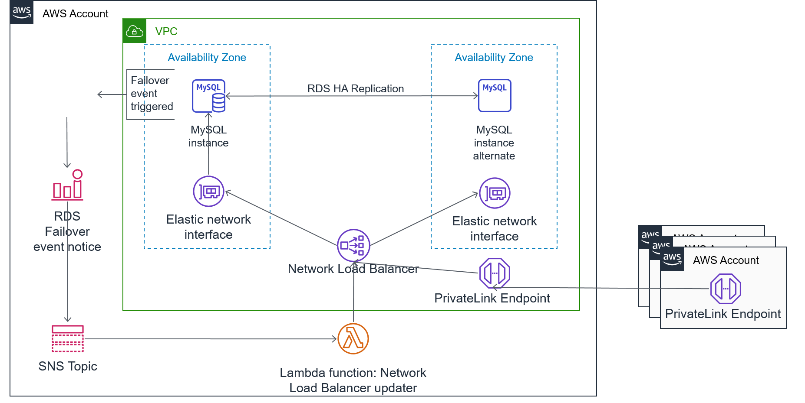

# Cross-account RDS access using AWS Privatelink demo

This demo shows how to leverage AWS Privatelink to publish a Relational Database Service (RDS) database from one account to other accounts. This method allows for point-to-point connectivity between accounts without relying on routing subnets. It leverages a Lambda function to keep the Privatelink's associated Network Load Balancer (NLB) updated with the RDS endpoint which is triggered whenever the RDS cluster enters a failover state.

Note: check the AWS documentation for NLB features. As of publishing this demo, an NLB only supports an EC2 instance or IP address as targets, hence the need for the associated Lambda function. Should NLB ever support DNS entries as targets, the Lambda won't be needed.

Running this CDK code generates the left side of the below architecture diagram.

This demo creates the following:
1. A Virtual Private Cloud (VPC) with two isolated (no Internet) subnets
2. An RDS MySQL multi-availability zone cluster
3. A Simple Notification Service (SNS) topic for receiving RDS failover events
4. An RDS event subscription filtered by failover notices and published to the SNS topic
5. An NLB and asociated Privatelink (aka VPC Endpoint Service) endpoint
6. A Lambda function, triggered by SNS, that resolves the RDS endpoint DNS name to the IP address of the active instance and updates the NLB's target group accordingly

## Pre-requisites

To use this demo, you need:
1. The [AWS Cloud Development Kit (CDK) ](https://aws.amazon.com/cdk/) installed. See [Getting Started With AWS CDK](https://docs.aws.amazon.com/cdk/latest/guide/getting_started.html) for installation and usage.
2. An AWS account to deploy this demo in.
3. Another AWS account to consume the database from.
4. This other account will need a VPC in the same region as where you deploy the CDK stack, and subnets created. Ideally, subnets should exist in all Availabity Zones, but at a minimum will need them in the same AZ-IDs as the RDS account's. You can see subnet AZ-IDs in the AWS Console under / VPC / Subnets in the column "Availability Zone IDs" and will, for us-east, look like "use-azN".

## Usage

### RDS Account
1. Clone this repo locally.
2. Open app.py and adjust the "props" section with appropriate values. At least "principals_to_share_with" needs to be adjusted.
3. Deploy the CDK stack: `cdk deploy --all`.
4. Watch the output for "function ARN:" and for "Endpoint service ID: " and make note of the values.
5. Once deployed, kick off the Lambda function for initially populating the target group, either by logging into the AWS Console and executing the function or running `run_lambda.py [arn from output]`.

### Consumer Account
1. From the AWS account listed in "principals_to_share_with", log in and go to VPC / Endpoints and create a new Endpoint. 
2. Choose custom and search by the "Endpoint service ID" from the output. 
3. Scroll down and ensure appropriate subnets are selected. Note: you will need a VPC already created with subnets in the same Availability Zones as the RDS account. The security group you assign should allow for the DB port from the instances/applications you'll be querying RDS.

## Testing

In the AWS account listed under "principals_to_share_with", you can create an EC2 instance that can route to the Endpoint you created and use the MySql cli to connect.